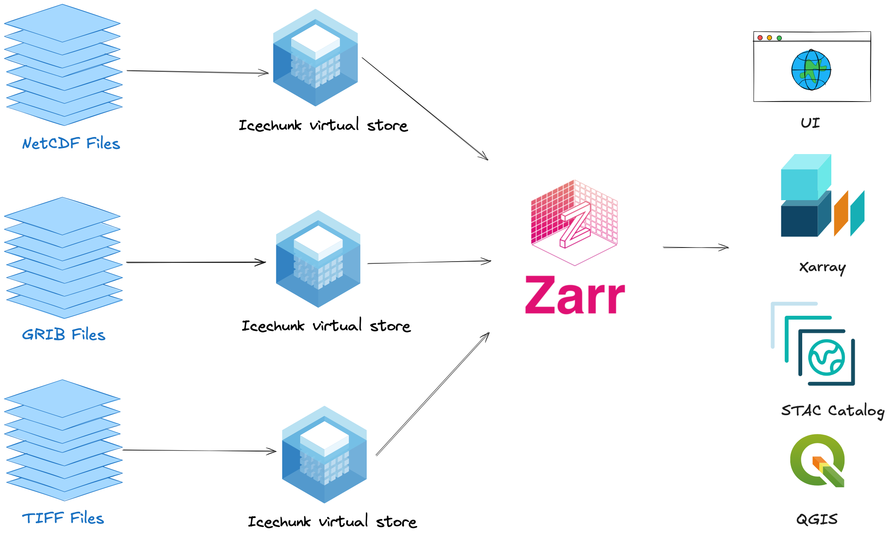

Presented at the [Building Open Connected Scientific Data Products for the Cryosphere](https://englacial.org/pages/2026-hackdays.html) hackdays, April 2026.

## The problem

You have data files. Lots of them. NetCDF, HDF5, GeoTIFF, sitting on a server or in the cloud. To do anything with them, you download, open, and extract what you need. If someone else wants to build on your work, they download the same files and start over.

It's not connected, and it's often times not reproducible.

```{mermaid}
flowchart LR
    A[HDF5 on S3] -->|download 3GB| B[Local copy]
    B -->|open + extract| C[Your analysis]
    A -->|download 3GB again| D[Collaborator's copy]
    D -->|open + extract| E[Their analysis]
    style A fill:#f9f,stroke:#333
    style B fill:#fbb,stroke:#333
    style D fill:#fbb,stroke:#333
```

## What if existing files were already Zarr?

[Zarr](https://zarr.dev/) is a cloud-native format designed for partial reads. You can grab one chunk without downloading the whole file. But nobody wants to re-encode petabytes of existing data into a new format.

[Virtual Zarr](https://virtualzarr.cloud/) enables performant, cloud-optimized access to archival data formats like NetCDF and HDF5 without duplicating any data.



[VirtualiZarr](https://github.com/zarr-developers/VirtualiZarr) reads the metadata from existing files (HDF5, NetCDF, GeoTIFF) and creates a lightweight index: "chunk 0 is at byte offset X in this file, chunk 1 is at byte Y." The index is tiny. The data stays where it is. This only needs to happen **once** per file.

[Icechunk](https://icechunk.io/) stores that index in a versioned, git-like repository. You commit it, share it, and anyone can open it with xarray. Every subsequent read goes through the Icechunk store, no re-virtualization needed. When new data arrives, you virtualize just the new files, append, and commit.

```{mermaid}
flowchart LR
    subgraph once["Once"]
        A[HDF5 on S3] -.->|read metadata| B[VirtualiZarr]
        B -->|chunk index| C[Icechunk store]
    end
    subgraph every["Every read"]
        C -->|xr.open_zarr| D[Your analysis]
        C -->|xr.open_zarr| E[Collaborator's analysis]
        A -.->|fetch chunks on demand| D
        A -.->|fetch chunks on demand| E
    end
    style A fill:#f9f,stroke:#333
    style C fill:#bfb,stroke:#333
    style once fill:#fff,stroke:#999,stroke-dasharray: 5 5
    style every fill:#fff,stroke:#999
```

No data is copied. The original files stay where they are. Everyone reads from the same virtual store, and only the chunks they need are fetched.

## This demo

We apply this pattern to [NISAR](https://nisar.jpl.nasa.gov/) GUNW (Geocoded Unwrapped Interferogram) data. NISAR is a new SAR mission that measures surface deformation, including ice sheet motion. The demo uses a GUNW granule over New Zealand (chosen because NISAR's cryosphere products are still in early release), but the workflow applies to any HDF5 dataset.

To explore how NISAR chunk manifests look interactively, see the [NISAR Manifest Explorer](https://github.com/virtual-zarr/nisar-manifest-explorer).

## Notebooks

1. [**Virtualize NISAR GUNW**](./01-virtualize-s3.ipynb): Create virtual references via S3 and persist to Icechunk
2. [**Query via Icechunk**](./02-query-icechunk.ipynb): Open the Icechunk store, extract a spatial subset, and visualize
3. [**Query via h5netcdf**](./03-query-h5netcdf.ipynb): Same query the traditional way (baseline comparison)

There is also an [HTTPS version](./01-virtualize-https.ipynb) of the virtualization notebook that works from anywhere, though Icechunk support for earthaccess HTTPS is still in progress.

## Why this matters for hackday projects

If you're working with archival data this week (HDF5, NetCDF, GeoTIFF), you can use this pattern to:

- Make your data product **queryable** without converting to a new format
- Make it **shareable** by committing virtual references to Icechunk
- Make it **updatable** by appending new data and committing a new snapshot
- Make it **reproducible** by pinning to a specific Icechunk snapshot

## Running locally

```bash
git clone https://github.com/virtual-zarr/connected-data-products-demo
cd connected-data-products-demo
uv sync
uv run jupyter lab
```

Requires a [NASA Earthdata](https://urs.earthdata.nasa.gov/) account (free).

## Serving the docs

```bash
uv run myst start
```
